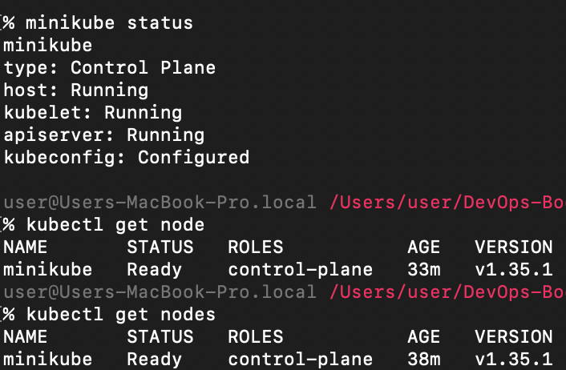
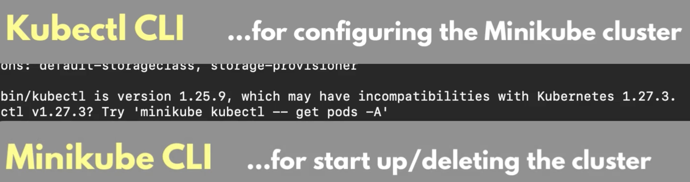
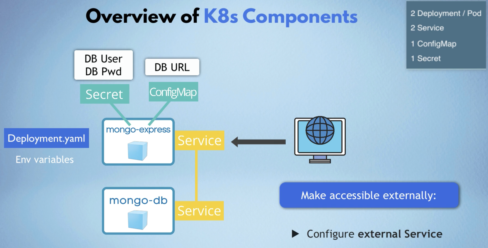
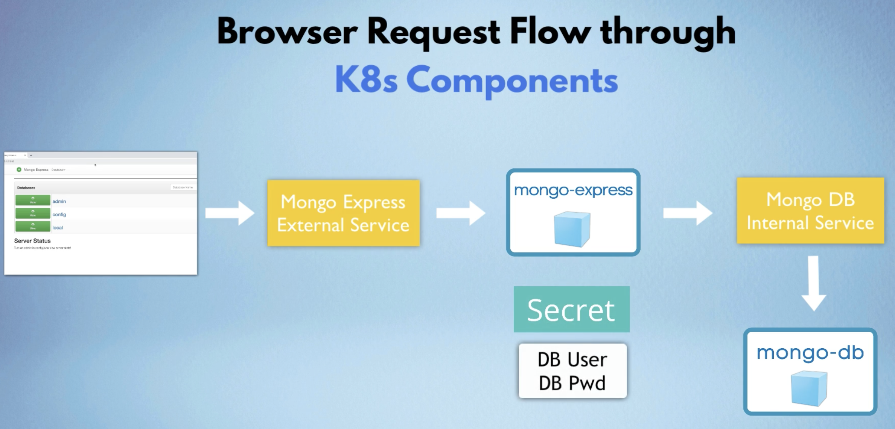
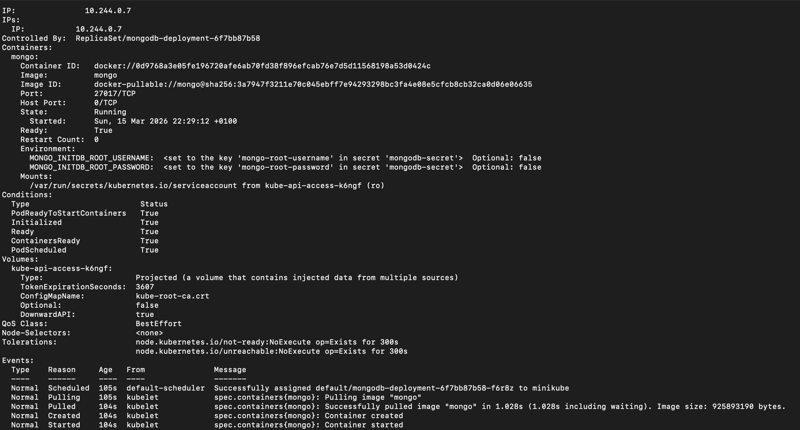
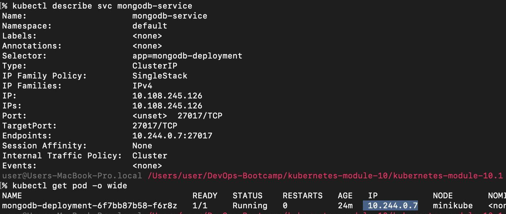
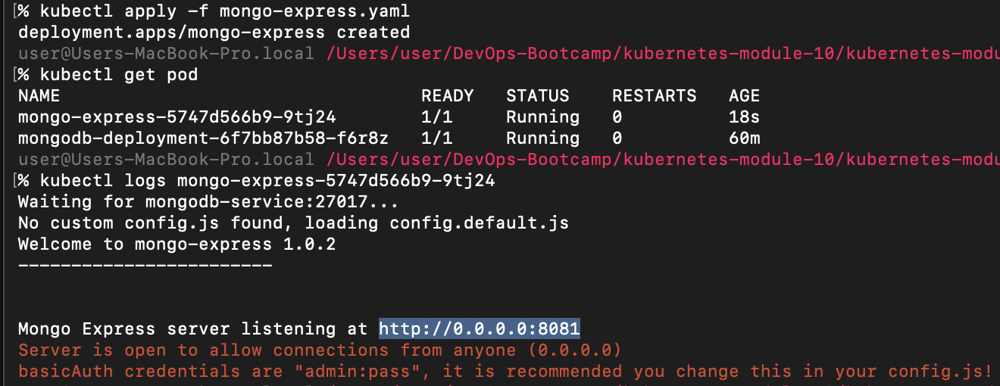
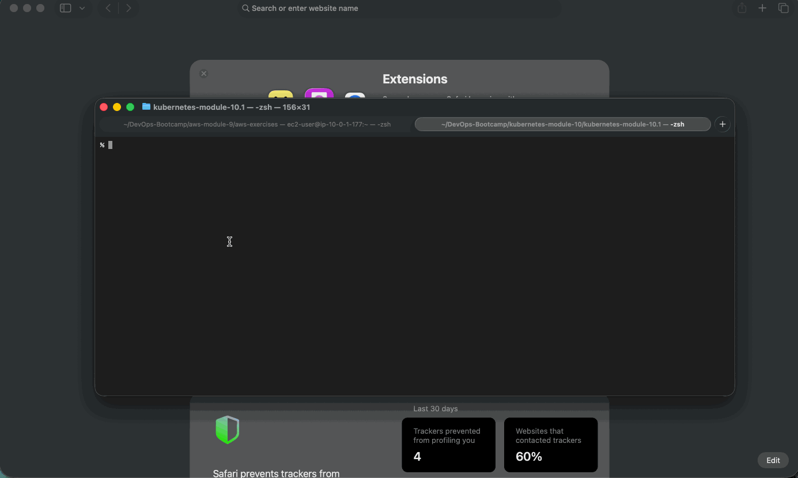

# Module 10 - Container Orchestration with Kubernetes

This repository contains a demo project created as part of my **DevOps studies** in the **TechWorld with Nana – DevOps Bootcamp**.

https://www.techworld-with-nana.com/devops-bootcamp

***Demo Project:*** Deploy MongoDB and Mongo Express into local K8s cluster

***Technologies used:*** Kubernetes, Docker, MongoDB, Mongo Express

***Project Description:***

- Setup local K8s cluster with Minikube
- Deploy MongoDB and MongoExpress with configuration and credentials extracted into ConfigMap and Secret

---

## Prerequisites

Install Minikube by following the [official documentation](https://minikube.sigs.k8s.io/docs/start/).





---

## Deploy MongoDB and Mongo Express with ConfigMap and Secret

### Architecture Overview

The setup consists of a MongoDB database and a Mongo Express web UI, with credentials stored in a Kubernetes **Secret** and the database URL stored in a **ConfigMap**.





#### 1. Generate the MongoDB Deployment manifest

```sh
kubectl create deploy mongodb-deployment --image mongo --dry-run=client -o yaml > mongo.yaml
```

See: [mongo.yaml](./mongo.yaml)

#### 2. Create the Secret for database credentials

Base64-encode the credentials:

```sh
echo -n 'root-user' | base64
# cm9vdC11c2Vy

echo -n 'root-password' | base64
# cm9vdC1wYXNzd29yZA==
```

See: [mongo-secret.yaml](./mongo-secret.yaml)

Apply the secret:

```sh
kubectl apply -f mongo-secret.yaml
```

#### 3. Reference the Secret in the MongoDB Deployment

Add the following environment variables to the container spec in `mongo.yaml`:

```yaml
env:
  - name: MONGO_INITDB_ROOT_USERNAME
    valueFrom:
      secretKeyRef:
        name: mongodb-secret
        key: mongo-root-username
  - name: MONGO_INITDB_ROOT_PASSWORD
    valueFrom:
      secretKeyRef:
        name: mongodb-secret
        key: mongo-root-password
```

See: [mongo.yaml](./mongo.yaml)

#### 4. Deploy MongoDB

```sh
kubectl apply -f mongo.yaml
```



#### 5. Add a ClusterIP Service for MongoDB

Append the following Service definition to `mongo.yaml`:

```yaml
---
apiVersion: v1
kind: Service
metadata:
  name: mongodb-service
spec:
  selector:
    app: mongodb-deployment
  ports:
    - protocol: TCP
      port: 27017
      targetPort: 27017
```

See: [mongo.yaml](./mongo.yaml)

Apply the updated manifest:

```sh
kubectl apply -f mongo.yaml
```



#### 6. Create a ConfigMap for the database URL

```sh
kubectl create configmap mongodb-configmap \
  --from-literal=database_url="mongodb-service:27017" \
  --dry-run=client -o yaml > mongo-configmap.yaml
```

Apply the ConfigMap:

```sh
kubectl apply -f mongo-configmap.yaml
```

#### 7. Create the Mongo Express Deployment

Generate the base manifest:

```sh
kubectl create deploy mongo-express --image mongo-express --dry-run=client -o yaml > mongo-express.yaml
```

Then add the following environment variables to the container spec:

```yaml
env:
  - name: ME_CONFIG_MONGODB_ADMINUSERNAME
    valueFrom:
      secretKeyRef:
        name: mongodb-secret
        key: mongo-root-username
  - name: ME_CONFIG_MONGODB_ADMINPASSWORD
    valueFrom:
      secretKeyRef:
        name: mongodb-secret
        key: mongo-root-password
  - name: DATABASE_URL
    valueFrom:
      configMapKeyRef:
        name: mongodb-configmap
        key: database_url
  - name: ME_CONFIG_MONGODB_URL
    value: "mongodb://$(ME_CONFIG_MONGODB_ADMINUSERNAME):$(ME_CONFIG_MONGODB_ADMINPASSWORD)@$(DATABASE_URL)"
```

See: [mongo-express.yaml](./mongo-express.yaml)

Deploy Mongo Express:

```sh
kubectl apply -f mongo-express.yaml
```



#### 8. Add a LoadBalancer Service for Mongo Express

Append the following Service definition to `mongo-express.yaml`:

```yaml
---
apiVersion: v1
kind: Service
metadata:
  name: mongo-express-service
spec:
  selector:
    app: mongo-express
  type: LoadBalancer
  ports:
    - protocol: TCP
      port: 8081
      targetPort: 8081
      nodePort: 30000
```

See: [mongo-express.yaml](./mongo-express.yaml)

Apply the updated manifest:

```sh
kubectl apply -f mongo-express.yaml
```

#### 9. Access Mongo Express in the browser

Expose the service via Minikube:

```sh
minikube service mongo-express-service
```

Sign in with the default Mongo Express credentials:

| Field    | Value   |
|----------|---------|
| Username | `admin` |
| Password | `pass`  |

### Demo



